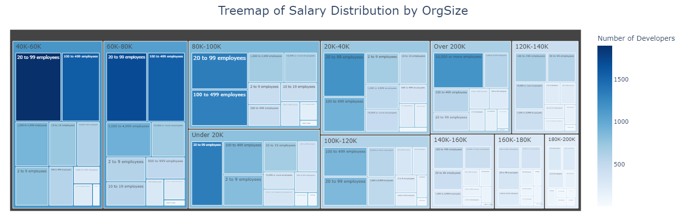

# Data Analysis

### Goal
The goal of this project is to conduct a comprehensive data analysis on the [Stack Overflow Annual Developer Survey (2023)](https://survey.stackoverflow.co/) dataset and extract valuable insights from the data.

### Questions of Interest
   - At what companies do developers get paid the most?
   - How much does remote working matter to employees?
   - How does coding experience affect the level of pay?
   - What’s the most popular method of learning to code?
   - What database systems and cloud services are the most popular?

## Methodology
### Loading Data
I used Python package `pandas` for loading and manipulating data. I used the following code to select columns that are relevant to my question of interests.
```python
# analysis will be conducted on selected columns:
selected_columns = ['Age',
                    'Employment', 
                    'RemoteWork', 
                    'LearnCode', 
                    'EdLevel', 
                    'YearsCode', 
                    'YearsCodePro', 
                    'DevType', 
                    'OrgSize', 
                    'DatabaseHaveWorkedWith',
                    'DatabaseWantToWorkWith',
                    'PlatformHaveWorkedWith',
                    'PlatformWantToWorkWith',
                    'Industry', 
                    'ConvertedCompYearly']
df = survey_raw_df[selected_columns]
```

### Data Preprocessing
For data preprocessing, I renamed the column `ConvertedCompYearly` to `Salary` within a DataFrame for simplicity and clarity. It then defines a series of salary bins, with increments of 20,000 up to 200,000, and a final bin for salaries over 200,000. Corresponding labels are also defined for each bin, such as 'Under 20K', '20K-40K', and so on up to 'Over 200K'. Using the `pd.cut` function, the code categorizes each salary in the `Salary` column based on these bins and assigns the appropriate label to a new column called `Salary_Level`. This process effectively groups the salary data into meaningful categories, making it easier to analyze and interpret salary distributions within the dataset.

### Data Visualizations
I used Python package `pyplot` for visualizing bar graphs and treemaps. These tools allowed me to examine distributions and patterns within selected columns effectively.


