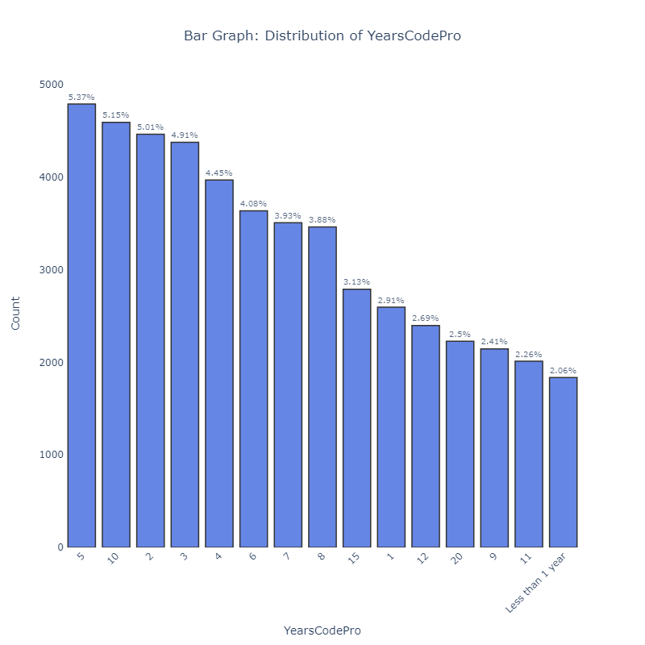
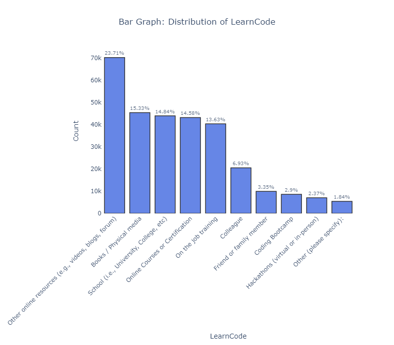

# Data Analysis

### Goal
The goal of this project is to conduct a comprehensive data analysis on the [Stack Overflow Annual Developer Survey (2023)](https://survey.stackoverflow.co/) dataset and extract valuable insights from the data.

### Questions of Interest
   - At what companies do developers get paid the most?
   - How much does remote working matter to employees?
   - How does coding experience affect the level of pay?
   - What’s the most popular method of learning to code?
   - What database systems and cloud services are the most popular?

## Methodology
### Loading Data
I used Python package `pandas` for loading and manipulating data. I used the following code to select columns that are relevant to my questions of interest.
```python
# analysis will be conducted on selected columns:
selected_columns = ['Age',
                    'Employment', 
                    'RemoteWork', 
                    'LearnCode',  
                    'YearsCodePro', 
                    'OrgSize', 
                    'DatabaseHaveWorkedWith',
                    'PlatformHaveWorkedWith',
                    'ConvertedCompYearly']
df = survey_raw_df[selected_columns]
```

### Data Preprocessing
For data preprocessing, I renamed the column `ConvertedCompYearly` to `Salary` within a DataFrame for simplicity and clarity. It then defines a series of salary bins, with increments of 20,000 up to 200,000, and a final bin for salaries over 200,000. Corresponding labels are also defined for each bin, such as 'Under 20K', '20K-40K', and so on up to 'Over 200K'. Using the `pd.cut` function, the code categorizes each salary in the `Salary` column based on these bins and assigns the appropriate label to a new column called `Salary_Level`. This process effectively groups the salary data into meaningful categories, making it easier to analyze and interpret salary distributions within the dataset.

### Data Visualizations
I used Python package `pyplot` for visualizing bar graphs and treemaps. These tools allowed me to examine distributions and patterns within selected columns effectively.

## Insights
#### **Salary**


- 7703 individuals reported to make **40K-60K**, composing of the majority 8.64% of respondants. 7210 counts for **60K-80K**, 5887 counts for **80K-100K**, and 4087 counts for **100K-120K**.


- The treemap of Salary Distribution by `OrgSize` shows that the majority of individuals who earn **60K-80K** work at companies with **20 to 99 employees**. The majority of individuals who earn **80K-100K** work at companies with either **20 to 99 employees** or **100-499 employees**. The majority of individuals who earn **100K-120K** work at companies with either **100-499 employees** or **20 to 99 employees**. The majority of individuals who earn **over 200K** work at companies with **10,000 employees or more**.

#### **Remote Work**


- Approximately one-third of survey participants work hybrid, and another one-third works remotely. This demonstrates the growing popularity of flexible work environments.

#### **Coding Experience**



- Most of the respondants have **5 years** of professional coding experience, totaling up to 4792 individuals or 5.37% of respondants.
- The majority of individuals who earn **40K-60K** or **60K-80K** have **5 years of professional coding experience**.
- The majority of individuals who earn **80K or above** have **10 years of professional coding experience**.

#### **Learning**


- The most common ways to learn coding are **online resources** like **videos, blogs, or forums**. Other common ways are **books/physical media, school, and online courses**. These account for more than two-thirds of the preferred learning methods.

#### **Databases and Cloud Services**


- The most common databases used are **PostgreSQL, MySQL, SQLite, MongoDB, and Microsoft SQL Server**.


- The most common cloud platform services are **Amazon Web Services (AWS), Microsoft Azure, Google Cloud, Firebase, and Cloudfare**.

